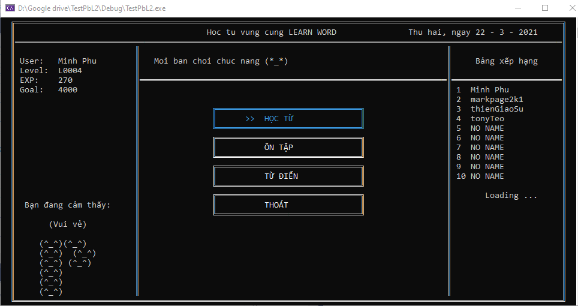
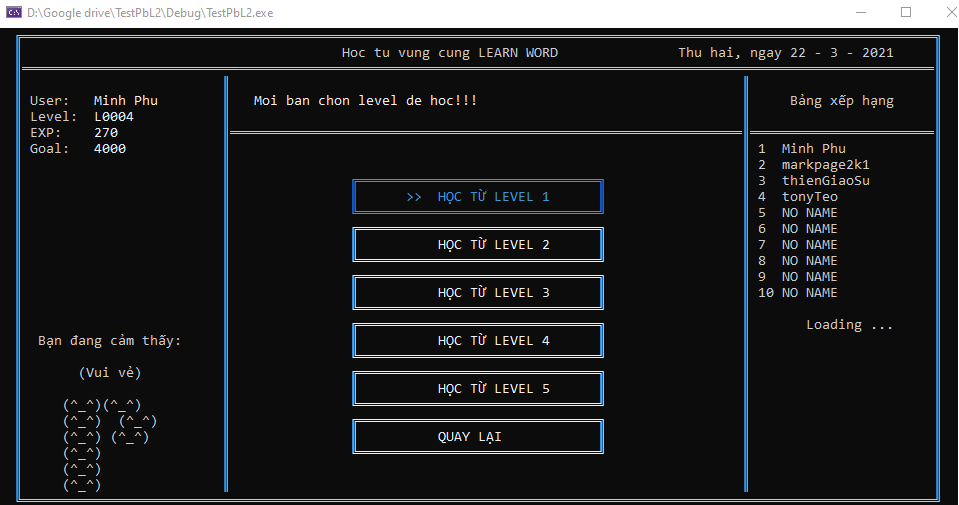
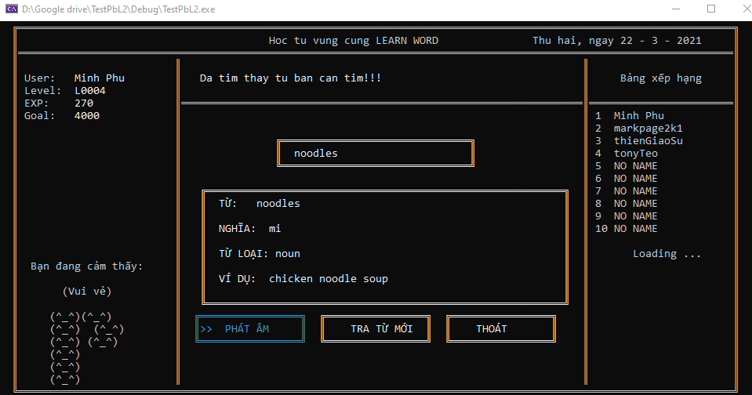
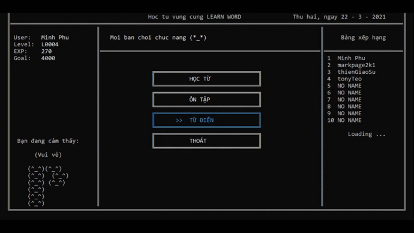

# PBL2_BaseProject
## Đề tài: Xây dựng app desktop học từ vựng tiếng anh cơ bản.
### Danh sách thành viên:
|STT|Tên|Chức vụ|Liên hệ|
|-|-|-|-|
|1|Đặng Hoài Phương|Giảng viên hướng dẫn||
|2|Đồng Minh Phú|Sinh viên thực hiện|dongminhphu846@gmail.com|
|3|Trần Phước Thiện|Sinh viên thực hiện||
### Thông tin ứng dụng:
+ Ngôn ngữ sử dụng: C/C++
+ IDE: Visua studio code 2019.
+ GUI: Console. (Hiển thị trực trên màn hình console).
+ Database: SQL server 2018.

### Các chức năng của ứng dụng: 
 
  + Học từ mới
    + Nếu là tài khoản mới lập thì sẽ đề xuất làm test để học phù hợp. (Hoặc có thể chọn học từ đầu).
    + Học theo level: Gồm có level 1->5

  
 
  + Ôn tập: hệ thống sẽ lưu lại thời gian bạn đã bắt đầu học từ đó, và lưu vào DB, sau khi tính đủ thời gian bạn quên, thì bạn sẽ có thể ôn lại.
  + Từ điển: Giúp bạn tra trừ có trong hệ thống.
  
  

> Note: Đây là phiên bản beta, nên sản phẩm chỉ mang tính chất demo.

> Để có thể xem demo chi tiết, bạn có thể xem [tại dây!]() (Hiện tại cho có video demo, sẽ được update trong thời gian sớm nhất!
